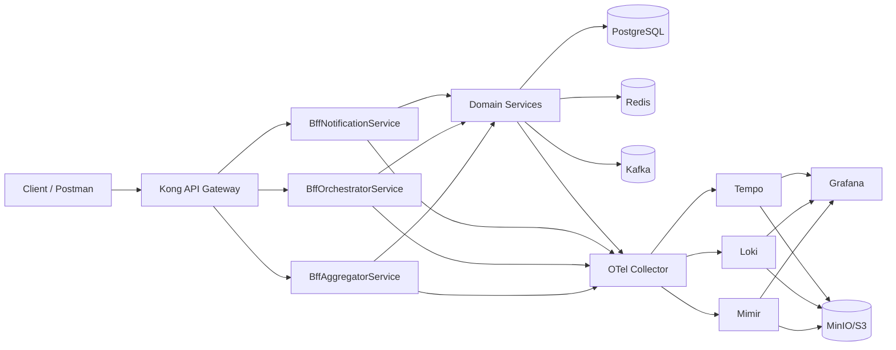

# DigiTrade Platform

DigiTrade is a modular microservices trading platform built on .NET 9, with API gateway routing, BFF services, durable orchestration patterns, and a full OpenTelemetry-based observability stack.

This README explains:

- What the platform contains
- How layers and services fit together
- How to run and operate locally
- How to use Aggregator, Orchestrator, and Notification services
- How to troubleshoot using Grafana dashboards

## Platform Architecture



## Layer Model

## Service Inventory (Numbered Order)

1. Kong API Gateway
2. BffAggregatorService
3. BffOrchestratorService
4. BffNotificationService
5. Identity
6. Account
7. Instrument
8. Trade
9. Order
10. Risk
11. Settlement
12. Ledger
13. Position
14. Portfolio
15. Pricing
16. Reporting
17. Audit

### 1. Gateway Layer

- Kong routes external traffic to BFFs and applies auth/rate limiting plugins.
- Route groups:
  - `/api/v1/read` -> BffAggregatorService
  - `/api/v1/write` -> BffOrchestratorService
  - `/api/v1/notifications` -> BffNotificationService

### 2. BFF Layer

- BffAggregatorService: read-focused aggregation endpoints across downstream services.
- BffOrchestratorService: write-focused synchronous and asynchronous business process orchestration.
- BffNotificationService: terminal completion recording, delivery queries, and stream endpoint.

### 3. Domain Service Layer

Core business APIs:

- Identity
- Account
- Instrument
- Trade
- Order
- Risk
- Settlement
- Ledger
- Position
- Portfolio
- Pricing
- Reporting
- Audit

### 4. Infrastructure Layer

- PostgreSQL (service persistence)
- Redis (cache and coordination)
- Kafka (event streaming)
- MinIO (local object storage backend for observability data)

### 5. Observability Layer

Telemetry routing model:

- Service -> OTLP gRPC -> OTel Collector -> Mimir (metrics)
- Service -> OTLP gRPC -> OTel Collector -> Loki (logs)
- Service -> OTLP gRPC -> OTel Collector -> Tempo (traces)

Grafana reads from Mimir, Loki, and Tempo.

## Service Highlights

### BffAggregatorService

Purpose: unified read and health aggregation across downstream services.

Current APIs:

- `GET /aggregations/services/health-summary`
- `GET /aggregations/services/readiness`
- `GET /aggregations/services/failures`
- `GET /aggregations/services/business-domains`

Gateway paths:

- `/api/v1/read/aggregations/services/health-summary`
- `/api/v1/read/aggregations/services/readiness`
- `/api/v1/read/aggregations/services/failures`
- `/api/v1/read/aggregations/services/business-domains`

### BffOrchestratorService

Purpose: start and track multi-service business processes.

Core orchestration shell APIs:

- `POST /orchestrations/requests/`
- `GET /orchestrations/requests/{orchestrationShellId}`

Business process catalog and starters:

- `GET /orchestrations/processes/catalog`
- Sync process starters:
  - `POST /orchestrations/processes/sync/trade-order-risk`
  - `POST /orchestrations/processes/sync/settlement-ledger`
  - `POST /orchestrations/processes/sync/portfolio-pricing`
- Async process starters:
  - `POST /orchestrations/processes/async/trade-lifecycle`
  - `POST /orchestrations/processes/async/risk-rebalance`
  - `POST /orchestrations/processes/async/post-trade-reporting`

Gateway paths:

- `/api/v1/write/orchestrations/requests/...`
- `/api/v1/write/orchestrations/processes/...`

### BffNotificationService

Purpose: track and expose notification delivery lifecycle for terminal events.

Current APIs:

- `POST /notifications/terminal-completions`
- `GET /notifications/deliveries/{notificationDeliveryId}`
- `GET /notifications/stream`

Gateway paths:

- `/api/v1/notifications/terminal-completions`
- `/api/v1/notifications/deliveries/{notificationDeliveryId}`
- `/api/v1/notifications/stream`

### Identity Service

Purpose: user identity and token lifecycle for platform access.

Common APIs used in local testing:

- `GET /health/live`
- `POST /api/v1/identity/users`
- `POST /api/v1/identity/tokens`
- `POST /api/v1/identity/tokens/introspect`

## Local Run Guide

## Prerequisites

- Docker Desktop
- .NET SDK 9

## Environment files

- Development: `.env.development`
- Production template: `.env.production`

## Start full local platform

```bash
DOTNET_SDK_TAG=9.0-noble-amd64 docker compose -f docker-compose.yml --env-file .env.development --profile app-placeholders up -d --build
```

## Check status

```bash
DOTNET_SDK_TAG=9.0-noble-amd64 docker compose -f docker-compose.yml --env-file .env.development --profile app-placeholders ps
```

## Stop stack

```bash
DOTNET_SDK_TAG=9.0-noble-amd64 docker compose -f docker-compose.yml --env-file .env.development --profile app-placeholders down --volumes
```

## Key Local Access Points

- Grafana: `http://localhost:3000`
- MinIO API: `http://localhost:9000`
- MinIO Console: `http://localhost:9001`
- Mimir: `http://localhost:9009`
- Loki: `http://localhost:3100`
- Tempo: `http://localhost:3200`
- OTel Collector health: `http://localhost:13133`
- Gateway: `http://localhost:5023`

## Deploy to AWS EKS

This guide uses two Kubernetes namespaces:

- `digitrade-staging` for testing and pre-production validation
- `digitrade-prod` for production

The flow is the same for both. The only differences are the namespace name, the image tag you deploy, and the Kubernetes secret values.

### Simple flow

1. Create or connect to your EKS cluster.
2. Create ECR repositories for the DigiTrade services.
3. Build each service from its Dockerfile and push the image to ECR.
4. Create a namespace for staging or production.
5. Create secrets for that namespace.
6. Apply the Kubernetes manifests with the correct namespace and image tags.
7. Expose the gateway only when you need external traffic.
8. Verify the rollout.

### 1. Prerequisites

- AWS account with permissions for EKS, ECR, IAM, and networking.
- Local tools:
  - `aws`
  - `kubectl`
  - `eksctl`
  - `docker`
- A working Docker build for each service in this repo.

### 2. Set the variables once

```bash
export AWS_REGION=us-east-1
export AWS_ACCOUNT_ID=$(aws sts get-caller-identity --query Account --output text)
export CLUSTER_NAME=digitrade-eks
export ECR_PREFIX=digitrade
```

Confirm your AWS login:

```bash
aws sts get-caller-identity
```

### 3. Create or connect to the EKS cluster

If you do not already have a cluster:

```bash
eksctl create cluster \
  --name "$CLUSTER_NAME" \
  --region "$AWS_REGION" \
  --nodes 3 \
  --node-type t3.large \
  --managed
```

If the cluster already exists, refresh kubeconfig:

```bash
aws eks update-kubeconfig --name "$CLUSTER_NAME" --region "$AWS_REGION"
kubectl get nodes
```

### 4. Create ECR repositories

Create one ECR repository per API service:

```bash
for svc in \
  identity-api account-api instrument-api trade-api order-api risk-api settlement-api ledger-api \
  position-api portfolio-api pricing-api reporting-api audit-api \
  bff-aggregator-api bff-orchestrator-api bff-notification-api
do
  aws ecr describe-repositories --repository-names "$ECR_PREFIX/$svc" --region "$AWS_REGION" >/dev/null 2>&1 || \
  aws ecr create-repository --repository-name "$ECR_PREFIX/$svc" --region "$AWS_REGION"
done
```

### 5. Build and push images

Use one tag for staging and another for production. A common pattern is:

- staging: `staging`
- production: `prod`

Example for staging:

```bash
export IMAGE_TAG=staging

aws ecr get-login-password --region "$AWS_REGION" | \
docker login --username AWS --password-stdin "$AWS_ACCOUNT_ID.dkr.ecr.$AWS_REGION.amazonaws.com"

while IFS='=' read -r svc dockerfile; do
  image="$AWS_ACCOUNT_ID.dkr.ecr.$AWS_REGION.amazonaws.com/$ECR_PREFIX/$svc:$IMAGE_TAG"
  docker build -f "$dockerfile" -t "$image" .
  docker push "$image"
done <<'EOF'
identity-api=src/Identity/Identity.Api/Dockerfile
account-api=src/Account/Account.Api/Dockerfile
instrument-api=src/Instrument/Instrument.Api/Dockerfile
trade-api=src/Trade/Trade.Api/Dockerfile
order-api=src/Order/Order.Api/Dockerfile
risk-api=src/Risk/Risk.Api/Dockerfile
settlement-api=src/Settlement/Settlement.Api/Dockerfile
ledger-api=src/Ledger/Ledger.Api/Dockerfile
position-api=src/Position/Position.Api/Dockerfile
portfolio-api=src/Portfolio/Portfolio.Api/Dockerfile
pricing-api=src/Pricing/Pricing.Api/Dockerfile
reporting-api=src/Reporting/Reporting.Api/Dockerfile
audit-api=src/Audit/Audit.Api/Dockerfile
bff-aggregator-api=src/BffAggregatorService/BffAggregatorService.Api/Dockerfile
bff-orchestrator-api=src/BffOrchestratorService/BffOrchestratorService.Api/Dockerfile
bff-notification-api=src/BffNotificationService/BffNotificationService.Api/Dockerfile
EOF
```

Repeat the same build/push flow later with `IMAGE_TAG=prod` for production.

### 6. Use one namespace for staging and another for production

Create the namespaces first:

```bash
kubectl create namespace digitrade-staging
kubectl create namespace digitrade-prod
```

Your current base manifests use the namespace name `digitrade`. For EKS, the easiest approach is to create a small overlay for each environment that changes the namespace to `digitrade-staging` or `digitrade-prod` and sets the image tags to the correct ECR tag.

The paths `k8s/overlays/staging` and `k8s/overlays/prod` are recommended example folder names. Create those overlays if they do not already exist.

For example:

- staging overlay uses `namespace: digitrade-staging` and image tag `staging`
- production overlay uses `namespace: digitrade-prod` and image tag `prod`

If you prefer not to create overlays yet, you can also update the namespace in `k8s/base/kustomization.yaml` before applying, but overlays are safer because staging and production stay separate.

### 7. Create secrets in each namespace

Create the application secret in staging:

```bash
kubectl -n digitrade-staging create secret generic digitrade-secrets \
  --from-literal=IDENTITY_DB_CONNECTION='Host=<host>;Port=5432;Database=identity;Username=<user>;Password=<pwd>' \
  --from-literal=ACCOUNT_DB_CONNECTION='Host=<host>;Port=5432;Database=account;Username=<user>;Password=<pwd>' \
  --from-literal=INSTRUMENT_DB_CONNECTION='Host=<host>;Port=5432;Database=instrument;Username=<user>;Password=<pwd>' \
  --from-literal=TRADE_DB_CONNECTION='Host=<host>;Port=5432;Database=trade;Username=<user>;Password=<pwd>' \
  --from-literal=ORDER_DB_CONNECTION='Host=<host>;Port=5432;Database=order;Username=<user>;Password=<pwd>' \
  --from-literal=RISK_DB_CONNECTION='Host=<host>;Port=5432;Database=risk;Username=<user>;Password=<pwd>' \
  --from-literal=SETTLEMENT_DB_CONNECTION='Host=<host>;Port=5432;Database=settlement;Username=<user>;Password=<pwd>' \
  --from-literal=LEDGER_DB_CONNECTION='Host=<host>;Port=5432;Database=ledger;Username=<user>;Password=<pwd>' \
  --from-literal=POSITION_DB_CONNECTION='Host=<host>;Port=5432;Database=position;Username=<user>;Password=<pwd>' \
  --from-literal=PORTFOLIO_DB_CONNECTION='Host=<host>;Port=5432;Database=portfolio;Username=<user>;Password=<pwd>' \
  --from-literal=PRICING_DB_CONNECTION='Host=<host>;Port=5432;Database=pricing;Username=<user>;Password=<pwd>' \
  --from-literal=REPORTING_DB_CONNECTION='Host=<host>;Port=5432;Database=reporting;Username=<user>;Password=<pwd>' \
  --from-literal=AUDIT_DB_CONNECTION='Host=<host>;Port=5432;Database=audit;Username=<user>;Password=<pwd>' \
  --from-literal=BFF_ORCHESTRATOR_DB_CONNECTION='Host=<host>;Port=5432;Database=bff_orchestrator;Username=<user>;Password=<pwd>' \
  --from-literal=BFF_NOTIFICATION_DB_CONNECTION='Host=<host>;Port=5432;Database=bff_notification;Username=<user>;Password=<pwd>'
```

Create the same secret again in production with production database values:

```bash
kubectl -n digitrade-prod create secret generic digitrade-secrets \
  --from-literal=IDENTITY_DB_CONNECTION='Host=<host>;Port=5432;Database=identity;Username=<user>;Password=<pwd>' \
  --from-literal=ACCOUNT_DB_CONNECTION='Host=<host>;Port=5432;Database=account;Username=<user>;Password=<pwd>' \
  --from-literal=INSTRUMENT_DB_CONNECTION='Host=<host>;Port=5432;Database=instrument;Username=<user>;Password=<pwd>' \
  --from-literal=TRADE_DB_CONNECTION='Host=<host>;Port=5432;Database=trade;Username=<user>;Password=<pwd>' \
  --from-literal=ORDER_DB_CONNECTION='Host=<host>;Port=5432;Database=order;Username=<user>;Password=<pwd>' \
  --from-literal=RISK_DB_CONNECTION='Host=<host>;Port=5432;Database=risk;Username=<user>;Password=<pwd>' \
  --from-literal=SETTLEMENT_DB_CONNECTION='Host=<host>;Port=5432;Database=settlement;Username=<user>;Password=<pwd>' \
  --from-literal=LEDGER_DB_CONNECTION='Host=<host>;Port=5432;Database=ledger;Username=<user>;Password=<pwd>' \
  --from-literal=POSITION_DB_CONNECTION='Host=<host>;Port=5432;Database=position;Username=<user>;Password=<pwd>' \
  --from-literal=PORTFOLIO_DB_CONNECTION='Host=<host>;Port=5432;Database=portfolio;Username=<user>;Password=<pwd>' \
  --from-literal=PRICING_DB_CONNECTION='Host=<host>;Port=5432;Database=pricing;Username=<user>;Password=<pwd>' \
  --from-literal=REPORTING_DB_CONNECTION='Host=<host>;Port=5432;Database=reporting;Username=<user>;Password=<pwd>' \
  --from-literal=AUDIT_DB_CONNECTION='Host=<host>;Port=5432;Database=audit;Username=<user>;Password=<pwd>' \
  --from-literal=BFF_ORCHESTRATOR_DB_CONNECTION='Host=<host>;Port=5432;Database=bff_orchestrator;Username=<user>;Password=<pwd>' \
  --from-literal=BFF_NOTIFICATION_DB_CONNECTION='Host=<host>;Port=5432;Database=bff_notification;Username=<user>;Password=<pwd>'
```

### 8. Deploy staging

Apply the staging overlay or staging-specific manifest set. If you created the recommended overlay folder, this is the command to use:

```bash
kubectl apply -k k8s/overlays/staging
kubectl -n digitrade-staging get deploy
kubectl -n digitrade-staging get pods
kubectl -n digitrade-staging get svc
```

If you are still using the base manifests temporarily, make sure they point to `digitrade-staging` before applying.

### 9. Expose the staging gateway for testing

For test traffic, expose `api-gateway` in staging:

```bash
kubectl -n digitrade-staging patch svc api-gateway -p '{"spec":{"type":"LoadBalancer"}}'
kubectl -n digitrade-staging get svc api-gateway -w
```

Use the external IP to run test requests against the staging namespace.

### 10. Deploy production

After staging is verified and the production images are pushed, apply the production overlay. If you created the recommended overlay folder, this is the command to use:

```bash
kubectl apply -k k8s/overlays/prod
kubectl -n digitrade-prod get deploy
kubectl -n digitrade-prod get pods
kubectl -n digitrade-prod get svc
```

Keep production isolated from staging by using the production namespace only for live traffic.

### 11. Expose the production gateway

Only expose the production gateway when you are ready for live traffic:

```bash
kubectl -n digitrade-prod patch svc api-gateway -p '{"spec":{"type":"LoadBalancer"}}'
kubectl -n digitrade-prod get svc api-gateway -w
```

### 12. Verify both environments

```bash
kubectl -n digitrade-staging rollout status deploy/identity-api
kubectl -n digitrade-staging rollout status deploy/api-gateway

kubectl -n digitrade-prod rollout status deploy/identity-api
kubectl -n digitrade-prod rollout status deploy/api-gateway
```

Useful checks:

- `kubectl -n digitrade-staging logs deploy/api-gateway --tail=100`
- `kubectl -n digitrade-prod logs deploy/api-gateway --tail=100`
- `kubectl -n digitrade-staging get events --sort-by=.lastTimestamp`
- `kubectl -n digitrade-prod get events --sort-by=.lastTimestamp`

### 13. Easy promotion path

1. Build and push the next image tag to ECR.
2. Deploy it to `digitrade-staging` first.
3. Run smoke tests in staging.
4. Promote the same tag to `digitrade-prod` after approval.
5. Watch rollout status in production.

### 14. Rollback

```bash
kubectl -n digitrade-staging rollout undo deploy/<service-name>
kubectl -n digitrade-prod rollout undo deploy/<service-name>
```

### 15. Common EKS issues

- `ImagePullBackOff`:
  - Check the ECR URI and tag.
  - Confirm the node role can read from ECR.
  - Confirm the image was pushed to the correct repository.
- Pods fail with database errors:
  - Check the namespace secret values.
  - Confirm the database is reachable from the cluster.
- Gateway does not get an external IP:
  - Check the service type.
  - Confirm your subnets are tagged correctly for AWS load balancers.
- Probes fail during startup:
  - Check application logs in the target namespace.
  - Confirm the service dependencies and secrets are correct.

Tip: the cleanest approach is to keep two overlays, one for staging and one for production, so the namespace, image tag, and secrets stay separate.

## Deploy to Kubernetes on Docker Desktop

Use this path when you want to test the same Kubernetes manifests locally on Docker Desktop instead of on AWS.

This is the simplest workflow because Docker Desktop shares the local Docker image cache with Kubernetes, so you do not need ECR or a cloud cluster.

### Simple flow

1. Enable Kubernetes in Docker Desktop.
2. Make sure `kubectl` is pointing at the Docker Desktop cluster.
3. Build the DigiTrade images locally.
4. Apply the base Kubernetes manifests.
5. Open the gateway with `kubectl port-forward`.
6. Test the APIs and observability services locally.

### 1. Prerequisites

- Docker Desktop installed.
- Kubernetes enabled in Docker Desktop settings.
- Local tools:
  - `kubectl`
  - `docker`

### 2. Confirm the Docker Desktop Kubernetes context

Check that `kubectl` is pointing to the Docker Desktop cluster:

```bash
kubectl config current-context
kubectl cluster-info
```

If needed, switch to the Docker Desktop context in your kubeconfig.

### 3. Build the images locally

For Docker Desktop, you can build the service images on your machine and use the local tags that the manifests already reference:

```bash
docker compose -f docker-compose.yml build identity-api account-api instrument-api trade-api order-api risk-api settlement-api ledger-api position-api portfolio-api pricing-api reporting-api audit-api bff-aggregator-api bff-orchestrator-api bff-notification-api
```

If you prefer, you can also build each Dockerfile directly with `docker build`, but compose is usually the easiest option.

### 4. Keep the local image settings

The current Kubernetes manifests already point at local image names such as `identity-api:dev` and use `imagePullPolicy: Never`.

That means Docker Desktop Kubernetes will use the images you built locally instead of trying to pull from a registry.

### 5. Apply the base Kubernetes manifests

The base manifests use the `digitrade` namespace, which is fine for local testing.

```bash
kubectl apply -k k8s/base
kubectl -n digitrade get deploy
kubectl -n digitrade get pods
kubectl -n digitrade get svc
```

If the namespace does not exist yet, `k8s/base/namespace.yaml` creates it for you.

### 6. Access the gateway locally

The gateway Service is internal in Kubernetes, so the simplest way to test it on Docker Desktop is port-forwarding:

```bash
kubectl -n digitrade port-forward svc/api-gateway 8000:8000
```

Then use:

- `http://localhost:8000/health/live`
- `http://localhost:8000/api/v1/read/...`
- `http://localhost:8000/api/v1/write/...`

### 7. Check service health

```bash
kubectl -n digitrade rollout status deploy/identity-api
kubectl -n digitrade rollout status deploy/bff-aggregator-api
kubectl -n digitrade rollout status deploy/bff-orchestrator-api
kubectl -n digitrade rollout status deploy/bff-notification-api
kubectl -n digitrade rollout status deploy/api-gateway
```

Useful local checks:

- `kubectl -n digitrade logs deploy/api-gateway --tail=100`
- `kubectl -n digitrade logs deploy/identity-api --tail=100`
- `kubectl -n digitrade get events --sort-by=.lastTimestamp`

### 8. Refresh after code changes

When you change application code, rebuild the images and re-apply the manifests:

```bash
docker compose -f docker-compose.yml build
kubectl apply -k k8s/base
```

If a deployment does not pick up the new image immediately, restart the deployment:

```bash
kubectl -n digitrade rollout restart deploy/<service-name>
```

### 9. Notes for local testing

- Keep `imagePullPolicy: Never` for Docker Desktop so Kubernetes uses the local Docker image cache.
- Use port-forwarding for the gateway unless you intentionally change the Service type.
- If you want a staging-like or production-like local setup, create separate overlays and namespaces the same way as the AWS section.

## How to Test APIs on Docker Desktop

After you start the stack with Docker Compose, test the APIs through the gateway first. The gateway is the easiest entry point because it exercises Kong routing, auth, and downstream services together.

### 1. Start the stack and confirm it is healthy

```bash
DOTNET_SDK_TAG=9.0-noble-amd64 docker compose -f docker-compose.yml --env-file .env.development --profile app-placeholders up -d --build
DOTNET_SDK_TAG=9.0-noble-amd64 docker compose -f docker-compose.yml --env-file .env.development --profile app-placeholders ps
```
### 1. Stop the stack

```bash
docker compose -f docker-compose.yml --env-file .env.development down --volumes
```

If something is failing, inspect logs for the service you want to test:

```bash
docker compose -f docker-compose.yml --env-file .env.development logs -f api-gateway
docker compose -f docker-compose.yml --env-file .env.development logs -f identity-api
```

### 2. Use these local URLs

- Gateway: `http://localhost:5023`
- Identity API: `http://localhost:5010`
- Account API: `http://localhost:5011`
- Instrument API: `http://localhost:5012`
- Aggregator: `http://localhost:5024`
- Orchestrator: `http://localhost:5025`
- Notification: `http://localhost:5026`

### 3. Quick health checks

Start with health endpoints so you know the stack is reachable before testing business flows.

```bash
curl http://localhost:5023/health/live
curl http://localhost:5023/health/ready
curl http://localhost:5010/health/live
curl http://localhost:5024/health/live
curl http://localhost:5025/health/live
curl http://localhost:5026/health/live
```

### 4. Open Swagger through Kong

Use the gateway Swagger URLs from `docs/postman/README.md`:

- Identity: `http://localhost:5023/swagger/identity/swagger/index.html`
- Aggregator: `http://localhost:5023/swagger/aggregator/swagger/index.html`
- Orchestrator: `http://localhost:5023/swagger/orchestrator/swagger/index.html`
- Notification: `http://localhost:5023/swagger/notification/swagger/index.html`

These are useful when you want to try requests manually in the browser.

### 5. Test the authentication flow first

The simplest API test sequence is:

1. Register a user.
2. Request an access token.
3. Call a read or write API with `Authorization: Bearer <token>`.

Example calls through the gateway:

```bash
curl -X POST http://localhost:5023/api/v1/identity/users \
  -H "Content-Type: application/json" \
  -d '{"userName":"test-user","password":"P@ssw0rd!"}'
```

```bash
curl -X POST http://localhost:5023/api/v1/identity/tokens \
  -H "Content-Type: application/json" \
  -d '{"userName":"test-user","password":"P@ssw0rd!"}'
```

Copy the returned access token and use it like this:

```bash
curl http://localhost:5023/api/v1/read/aggregations/services/health-summary \
  -H "Authorization: Bearer <access_token>"
```

### 6. Test the main business flows

Once auth works, test the main gateway routes:

- Read flow through Aggregator:
  - `GET http://localhost:5023/api/v1/read/aggregations/services/health-summary`
  - `GET http://localhost:5023/api/v1/read/aggregations/services/readiness`
- Write flow through Orchestrator:
  - `POST http://localhost:5023/api/v1/write/orchestrations/requests/`
  - `GET http://localhost:5023/api/v1/write/orchestrations/requests/{orchestrationShellId}`
- Notification flow:
  - `POST http://localhost:5023/api/v1/notifications/terminal-completions`
  - `GET http://localhost:5023/api/v1/notifications/deliveries/{notificationDeliveryId}`
  - `GET http://localhost:5023/api/v1/notifications/stream`

### 7. Use Postman for repeatable tests

Import these files from `docs/postman`:

- `DigiTrade-Kong.postman_collection.json`
- `DigiTrade-DEV.postman_environment.json`

The recommended order is:

1. Register a user.
2. Issue a user access token.
3. Run the rest of the collection with the bearer token already set.

If needed, point the environment at the local gateway URL `http://localhost:5023`.

### 8. How to know a test passed

A good local API test should confirm all three of these:

- The gateway returns `200` or the expected business status code.
- The downstream service logs show the request arrived.
- The response contains the expected correlation id or payload data.

### 9. Best order to test

1. Gateway health.
2. Identity registration and token issuance.
3. Read APIs.
4. Write APIs.
5. Notification APIs.
6. Swagger and Postman regression checks.

## Observability and Incident Workflow

Use a dashboard-first flow from symptom to root cause.

1. Open DigiTrade Service Overview dashboard
2. Filter to one `service_name`
3. Review in order:
   - 5xx Error Ratio
   - P95 Latency
   - Request Rate
   - Log Volume
4. Jump to DigiTrade Trace and Log Correlation dashboard
5. Pivot logs -> trace using derived fields
6. Inspect slow/failing spans in Tempo
7. Apply fix and watch metrics stabilize

Interpretation quick guide:

- 5xx spikes with stable throughput: logic/dependency failures
- Latency rise before errors: saturation or downstream slowness
- Throughput collapse: availability/routing problems
- Log burst with warnings/errors: regression or config issue

## Postman Collections

Primary collections under `docs/postman`:

- `DigiTrade.local.postman_collection.json`
- `DigiTrade.BffOrchestrator.BusinessProcesses.postman_collection.json`

Recommended run order in `DigiTrade.BffOrchestrator.BusinessProcesses.postman_collection.json`:

1. `40 Identity Service APIs` (register user + issue token)
2. `30 BffAggregator Multi-Service APIs`
3. `00 Catalog`, `10 Sync Business Processes`, `20 Async Business Processes`

## Developer Notes

- All APIs are instrumented with OpenTelemetry and export via OTLP to OTel Collector.
- Gateway-propagated headers used across BFF flows include:
  - `X-Correlation-Id`
  - `Idempotency-Key`
  - `X-Authenticated-Subject`
  - `X-Authenticated-UserName`

## Useful Commands

```bash
# Build solution
dotnet build DigiTrade.sln

# Build specific BFF
dotnet build src/BffAggregatorService/BffAggregatorService.Api/BffAggregatorService.Api.csproj
dotnet build src/BffOrchestratorService/BffOrchestratorService.Api/BffOrchestratorService.Api.csproj
dotnet build src/BffNotificationService/BffNotificationService.Api/BffNotificationService.Api.csproj

# Inspect running containers
docker ps --filter "name=digitrade" --format "table {{.Names}}\t{{.Status}}"
```